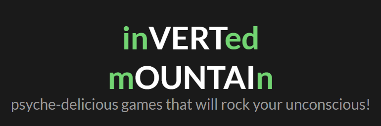

# Inverted Mountain // React version
###### psyche-delicious games that will rock your unconscious!

This repo is holds the codebase for indie games studio website, inVERTed mOUNTAIn.

### [Live demo](inmountapp.johndavidson.dev)

## Stack:

* HTML5
* CSS
* [Tailwind CSS 1.9.6](https://tailwindcss.com/)
* [PostCSS](https://postcss.org/)
* This project was created with [Create React App](https://github.com/facebook/create-react-app).

## Influences: 

* [W. Blake](https://en.wikipedia.org/wiki/William_Blake)
* [C.G. Jung](https://en.wikipedia.org/wiki/Carl_Jung)
* [T. McKenna](https://en.wikipedia.org/wiki/Terence_McKenna)
* [A. Jodorowsky](https://en.wikipedia.org/wiki/Alejandro_Jodorowsky)
* [Games of the 90s](https://www.youtube.com/watch?v=AAmPao9yIcc)
* [Culture of the 60s](https://www.youtube.com/watch?v=j800SVeiS5I)
* [Functional programming of the 2020s](https://elmjapan.org/)

